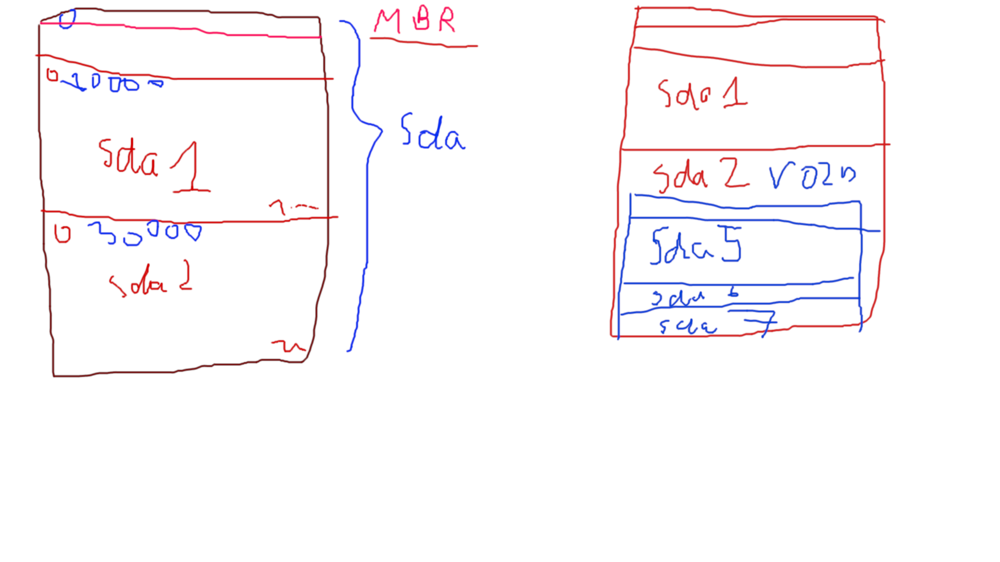
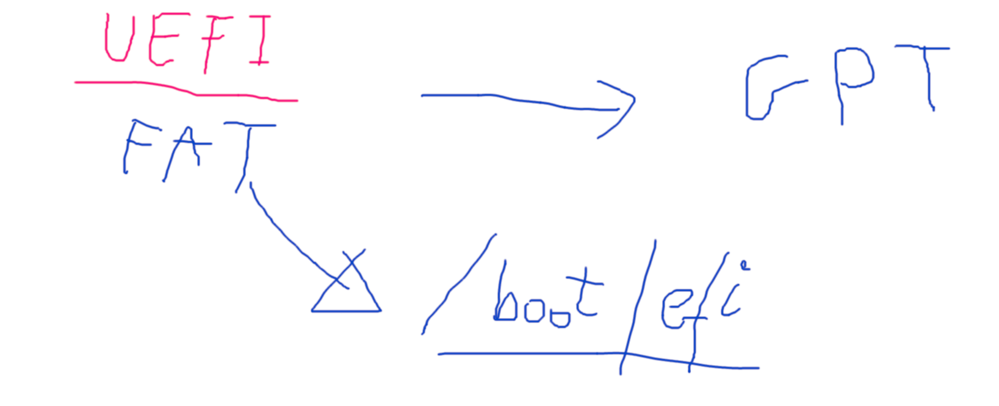
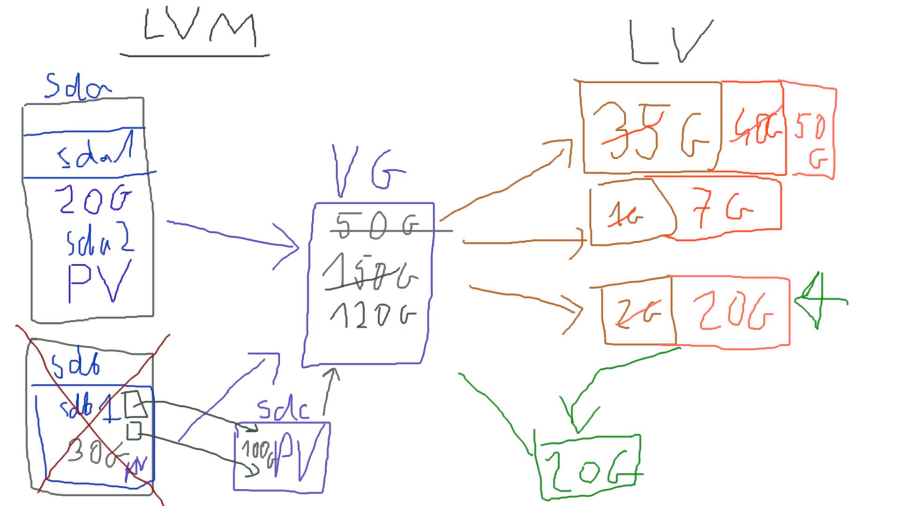
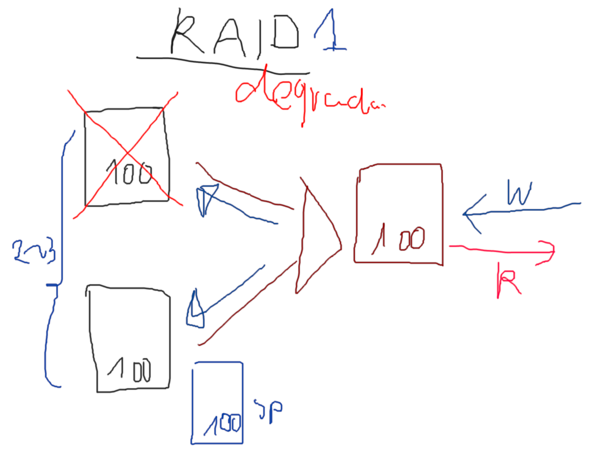
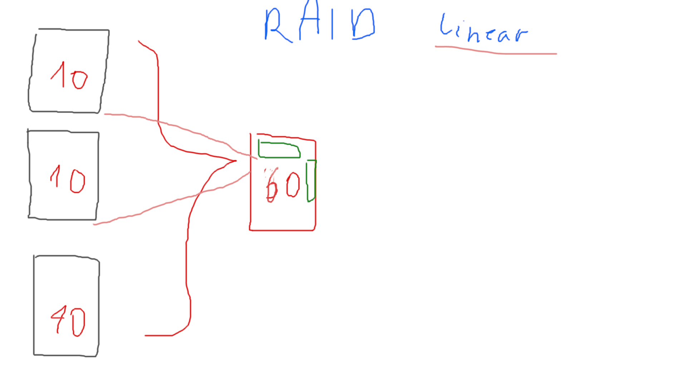
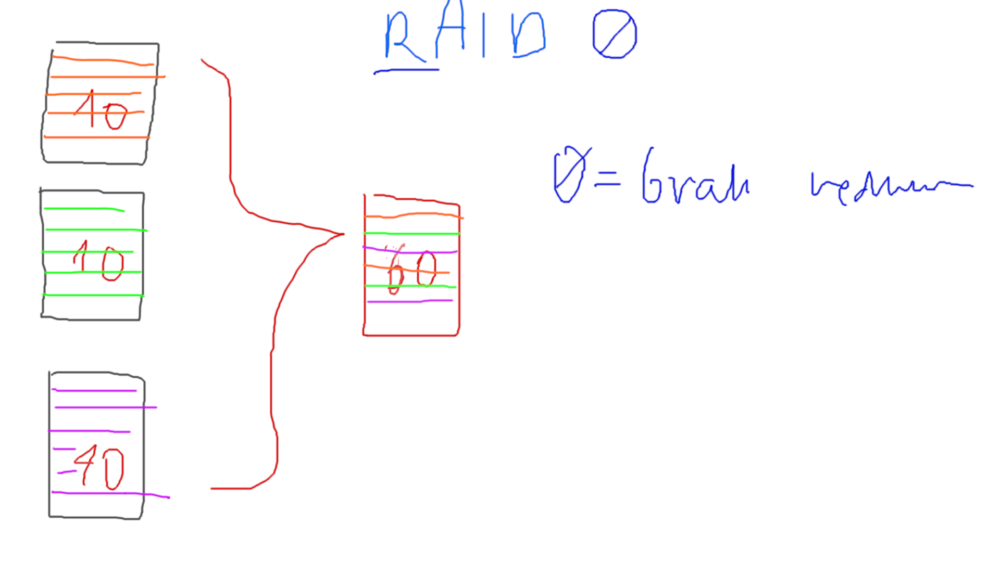
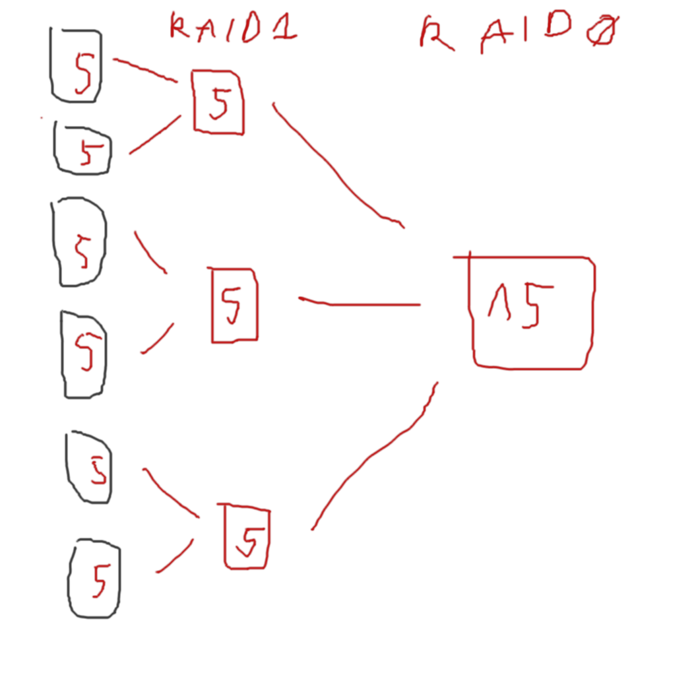
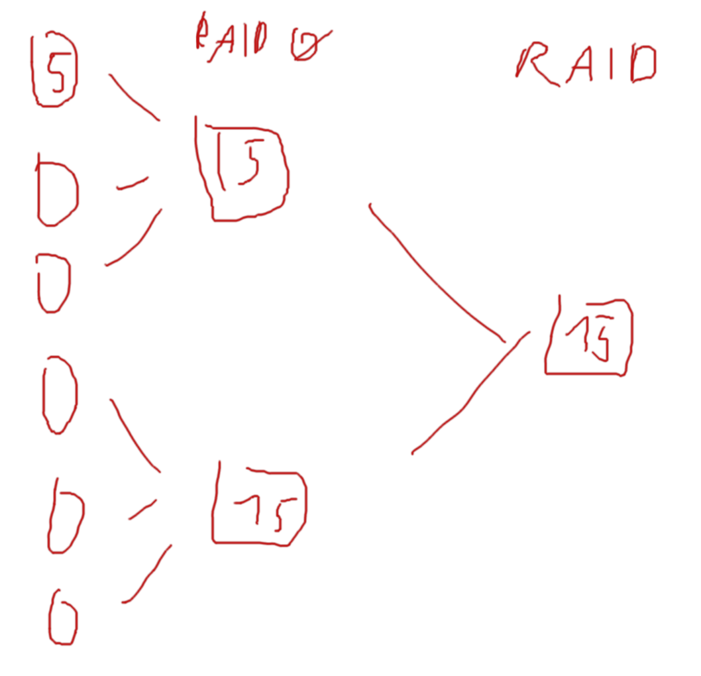
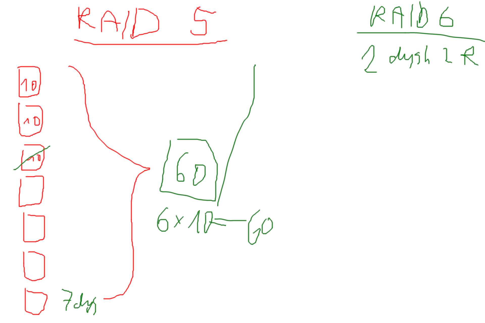

# Partycjonowanie, dyski itp

## MBR



<https://en.wikipedia.org/wiki/Master_boot_record>

## EFI, GPT



## LVM



## RAID








### RAID 5

```
	4 dyski po 10 bitów -> przestrzeń 30 bitów

	dysk 1:		1 0 0 1 1 1 0 0 1 1
	dysk 2:		0 1 1 0 1 1 1 1 0 1
	dysk 3:		1 1 1 0 1 0 0 1 0 1
        -----------------------------------
	dysk 4:         0 0 0 1 1 0 1 0 1 1 <-- wyliczone


	
	dysk 1:		1 0 0 1 1 1 0 0 1 1
	dysk 2:	        0 1 1 0 1 1 1 1 0 1 <-- odzyskane	
	dysk 3:		1 1 1 0 1 0 0 1 0 1
        -----------------------------------
	dysk 4:         0 0 0 1 1 0 1 0 1 1 <-- wyliczone


```

## Ubuntu network installer (mini.iso)

<http://archive.ubuntu.com/ubuntu/dists/focal/main/installer-amd64/current/legacy-images/netboot/>

